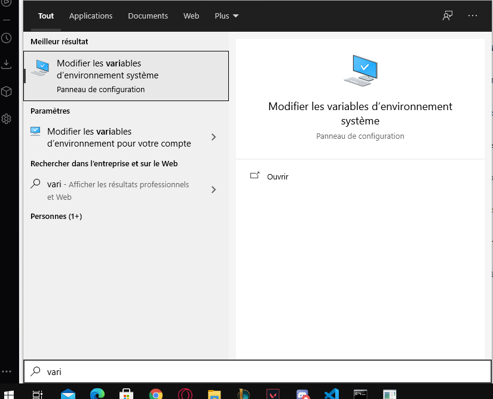
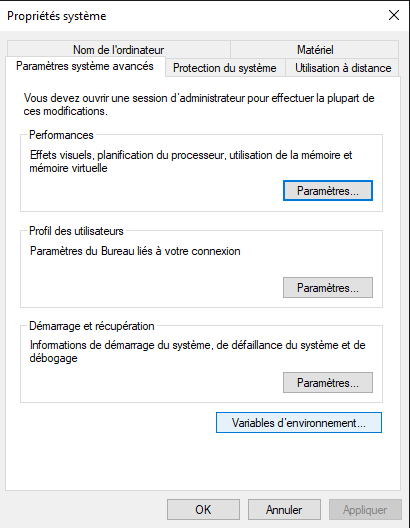
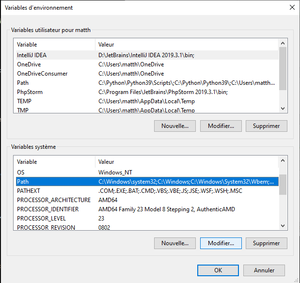
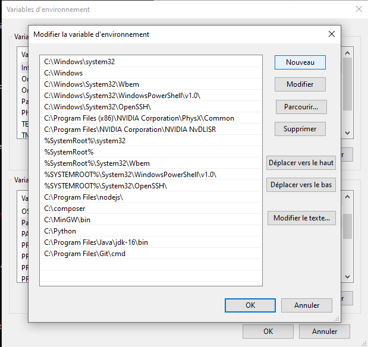
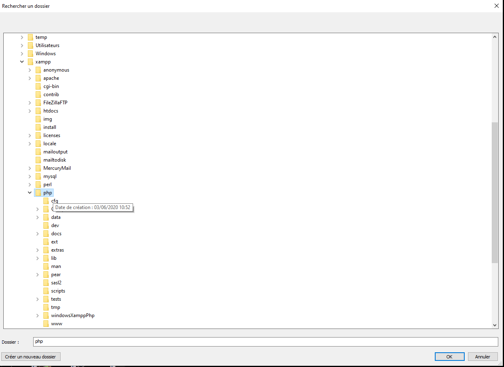
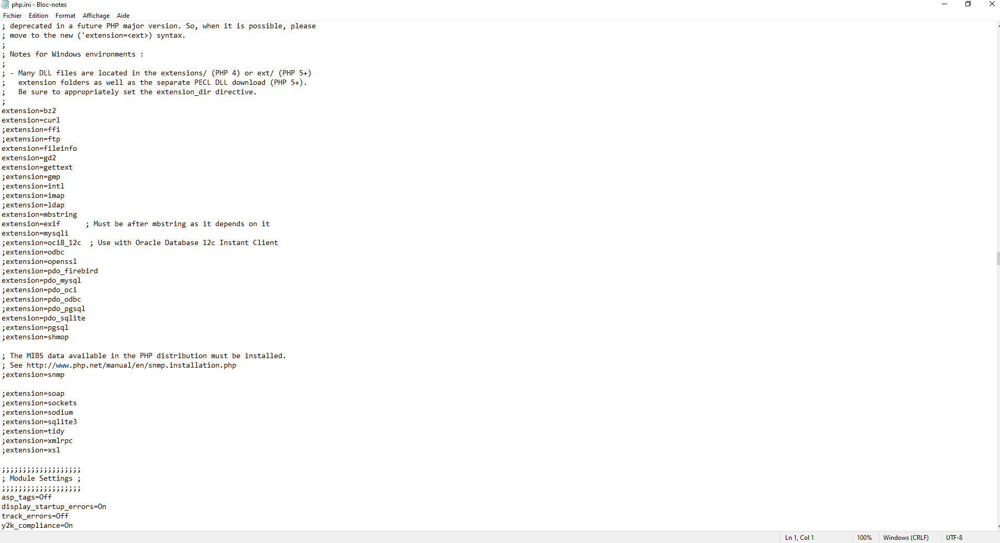
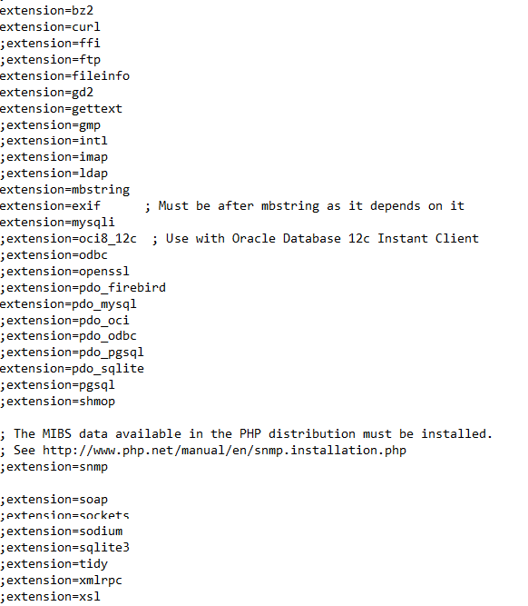

# Projet_BD

## Execution du Projet avec SQLite
 
* Se rendre dans le fichier **Croisiere_BD\SQLite\sqlite-tools-win32-x86-3350200**
* Exectuer sqlite3.exe
* Entrer les commandes suivante :
	**.open Projet_Croisiere.db**  &&  **.read ../../Tables/Tables.sql**

## Execution du Projet SQL avec l'interface (HTML/PHP)
* PHP doit être au préalable installer et configurer correctement. Pour se faire suivez les instructions dans cette vidéo:
	* https://www.youtube.com/watch?v=3mP3wiz6vN4
	
* Une fois installer, ajouter PHP aux variables d'environement de votre systeme:

* Sous Windows rechercher *variables d'environnement*. Sélectionner *Modifier les variables d'environnement*.
* 

* Sélectionner le *Path* puis *modifier*.
* 

* Sélectionner *Parcourir*.
* 

* Sélectionner l'emplacement du fichier d'installation de PHP que vous venez d'installer.
* 

* Puis dans le répertoire dans lequel a été PHP (*C:\xampp\php* si vous l'avez installer sur votre disque local), chercher le fichier le fichier **php.ini-development**
* Faire une copie de se fichier et renommer le en **php.ini**

* Ouvrer le fichier php.ini avec un editeur de text et scroller dans le fichier jusque appercevoir les extension comme sur l'image si dessous.

* Décommenter les lignes comme sur l'image si dessous (en retirant le symbole *;*).

* Ouvrir le projet avec Visual Studio Code (pour plus de simplicité) et ouvrer le dossier **PHP** dans un terminal intégré.
Ou vous pouvez tout simplement ouvrir un terminal de commande et vous rendre vers le fichier *PHP* se trouvant dans le projet.

* Executer la commande **php -S localhost:1234** pour exécuter un serveur local.

* Ouvrir le **main.html** tout simplement :)

## Problème JAVA JDBC

Erreur rencontrée :
	**java.sql.SQLException: No suitable driver found for jdbc:sqlite:C:\Users\matth\OneDrive\Documents\FAC\2021\BD\PROJET\Projet_Croisiere\SQLite\sqlite-tools-win32-x86-3350200\Projet_Croisiere.db
        at java.sql/java.sql.DriverManager.getConnection(DriverManager.java:702)
        at java.sql/java.sql.DriverManager.getConnection(DriverManager.java:251)
        at src.SQLiteDemo.main(SQLiteDemo.java:16)
        at java.base/jdk.internal.reflect.NativeMethodAccessorImpl.invoke0(Native Method)
        at java.base/jdk.internal.reflect.NativeMethodAccessorImpl.invoke(NativeMethodAccessorImpl.java:64)
        at java.base/jdk.internal.reflect.DelegatingMethodAccessorImpl.invoke(DelegatingMethodAccessorImpl.java:43)
        at java.base/java.lang.reflect.Method.invoke(Method.java:564)
        at jdk.compiler/com.sun.tools.javac.launcher.Main.execute(Main.java:415)
        at jdk.compiler/com.sun.tools.javac.launcher.Main.run(Main.java:192)
        at jdk.compiler/com.sun.tools.javac.launcher.Main.main(Main.java:132)**
